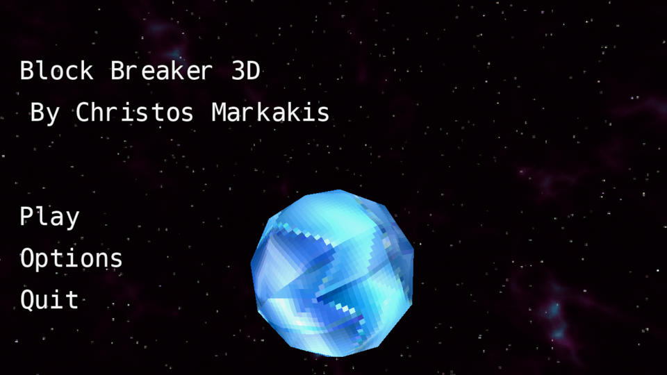
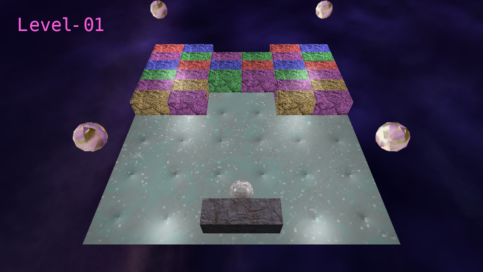

# Welcome To Block Breaker 3D

## <ins>About</ins>

 Block Breaker 3D is an implementation of the classic Atari Breakout arcade game in a custom made 3D renderer and mini game engine.

The engine is built on top of the SDL3 GPU API and mainly targets Vulkan.

### Dependencies
- SDL3
- GLM
- Assimp
- FreeType
- STB Image
- nlohmann json
***
### Project Goals
- [x] Basic 3D rendering of meshes
- [x] Mesh loading and parsing using Assimp
- [x] Texture loading
- [x] Phong shading model
- [x] Skybox and Cubemap samplers
- [x] Batched UI Layer Rendering
- [x] Font Rendering
- [x] Custom 2D Physics
- [x] Breakout Gameplay
- [ ] Custom Level Creation and Loading (WIP)
- [ ] Music and SFX (WIP)
***
### Preview Images

***

### Build Guide
#### Vulkan Backend
1. Install the Vulkan SDK from [LunarG](https://vulkan.lunarg.com/) in order to compile the GLSL shaders to SPRV
#### Using CMake
Option A: **Building Dependencies from Source**

Option B: **Relying on Fetch Content**
***