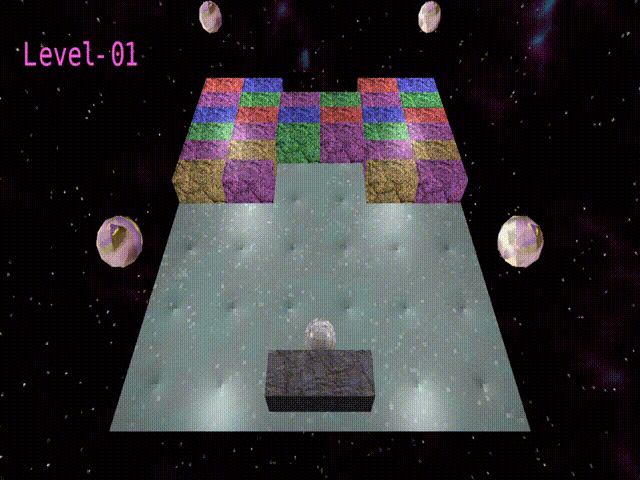

# Welcome To Block Breaker 3D

## <ins>About</ins>

 Block Breaker 3D is an implementation of the classic Atari Breakout arcade game in a custom made 3D renderer and mini game engine.

The engine is built on top of the SDL3 GPU API and mainly targets Vulkan.

### Dependencies
- SDL3
- GLM
- Assimp
- FreeType
- STB Image
- nlohmann json
***
### Project Goals
- [x] Basic 3D rendering of meshes
- [x] Mesh loading and parsing using Assimp
- [x] Texture loading
- [x] Phong shading model
- [x] Skybox and Cubemap samplers
- [x] Batched UI Layer Rendering
- [x] Font Rendering
- [x] Custom 2D Physics
- [x] Breakout Gameplay
- [ ] Custom Level Creation and Loading (WIP)
- [ ] Music and SFX (WIP)
***
### Preview Images

***

### Build Guide
#### Vulkan Backend
1. Install the Vulkan SDK from [LunarG](https://vulkan.lunarg.com/) in order to compile the GLSL shaders to SPRV
2. You should have an environment variable called "VULKAN_SDK" that points to the installation. If you don't see this, manually add one with that exact name to point to the install directory so that the build script can find VULKAN_SDK/bin/glslangValidator.exe.
#### Using CMake
Option A: **Building Dependencies from Source**

3. For faster build times, you may build each dependency from source

    [SDL3 v3.2.10](https://github.com/libsdl-org/SDL/tree/877399b2b2cf21e67554ed9046410f268ce1d1b2)  
    [GLM v1.0.1](https://github.com/g-truc/glm/tree/0af55ccecd98d4e5a8d1fad7de25ba429d60e863)  
    [Assimp v5.4.3](https://github.com/assimp/assimp/tree/c35200e38ea8f058812b83de2ef32c6093b0ece2)  
    [FreeType](https://gitlab.com/freetype/freetype/-/tree/ae3879c0a1214faa59fb598bf7d5a38bb35c054b)  
    [STB Image](https://github.com/nothings/stb)  
    [nlohmann json v3.12.0](https://github.com/nlohmann/json/tree/51a77f1dcac97f917db2621a5945f4305ff1bf9f)

4. Ensure that each of these built dependencies is in a directory where find_package can discover them

Option B (WIP): **Relying on Fetch Content**

5. Alternatively you can have the build script fetch these modules for you.
***